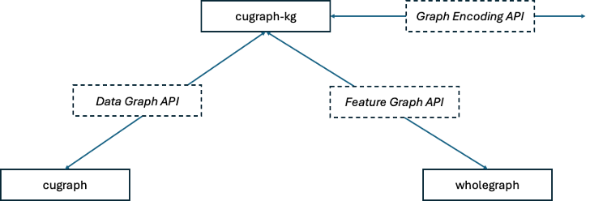

# cuGraph Knowledge Graph

When users hear Knowledge Graph (KG), or graph in general, there is the assumption that we are talking about a Graph Database.  While a graph database is one way to implement a knowledge graph, we are not building a graph database.  Therefore, we are not focusing on ACID compliance, being transactional, or worrying about multiple users. Our focus is just on being able to capture a KG.

The KG will also function as an DGL or PyG GraphStore.  The focus of this design are as follows:

* Homogeneous Graphs for GNN Training and general Graph
* Heterogeneous Graphs for GNNs Training and general Graph
* Temporal Graphs for GNNs Training and general Graph
* Heterogeneous and Temporal Graphs for GNNs Training and general Graph
* Dynamic Graphs
* GNN Inferencing
* LLM + Knowledge Graphs
* LLM + Knoeledge Graphs + GNNs

A knowledge graph can be viewed as a graph when considering its graph structure [7]. When it involves formal semantics, it can be taken as a knowledge base for interpretation and inference over facts [8].

There is a strong similarity between a Property Graph (PG) and a Knowledge Graph (KG). In a 2021 paper, Hogan et al [4] provides a comprehensive discussion on the topic Knowledge Graph where they define a KG as:
> The definition of a “knowledge graph” remains contentious …, where a number of (sometimes conflicting) definitions have emerged, varying from specific technical proposals to more inclusive general proposals. Herein, we define a knowledge graph as a graph of data intended to accumulate and convey knowledge of the real world, whose nodes represent entities of interest and whose edges represent potentially different relations between these entities. The graph of data (a.k.a. data graph) conforms to a graph-based data model, which may be a directed edge-labelled graph, a heterogeneous graph, a property graph, and so on …

That lack of a general consensus of a definition is common across many topics in computer science. Futia [1] blog series on the topic adds to the discussion and states that there are two perspective of a KG:

* the graph-based perspective, which allows us to perform graph algorithms and inductive reasoning techniques on KGs;
* the semantic-based perspective, which provides a formal framework for the semantic interpretation of the data, which is essential to perform deductive reasoning.

There are two main paths for creating a Knowledge Graph, the first is as a triple store and the second is as a Property Graph.  Since we are not supporting queries on any property, and since the goal for properties to be used in GNN training, then the triple store option is not useful.  Moreover, a triple store is not an efficient graph processing model.  Therefore, the solution is to create a property Graph.

Following the consensus that a Knowledge Graph is a collect of a data graph and a feature graph, the goal is to define data container APIs. For the data graph, the cuGraph Graph could be used to fill that need.  The property graph could be provided by WholeGraph. However, the design allows for any solution that adheres to the API to be used. That would allow graph database to plug their property graph object in.
 

This means that the cugraph-kg class is more of an orchestrator and controller.  Furthermore, this means that cugraph-kg will be pushing requirements down onto cugraph and WholeGraph to address required features.

## API Designs

* KG
* Data Graph
* Feature Graph
  * Graph Features
  * Node Features
  * Edge Features

## References

1.	Futia, Giuseppe.  Knowledge Graphs at a Glance.  Sept 27, 2020. https://towardsdatascience.com/knowledge-graphs-at-a-glance-c9119130a9f0
2.	Futia, Giuseppe. Improving Knowledge Graph Embeddings with Graph Neural Networks. Nov 23, 2020.  https://towardsdatascience.com/improving-knowledge-graph-embeddings-with-graph-neural-networks-8ffb14804199
3.	Ji, S., Pan, S., Cambria, E., Marttinen, P., & Philip, S. Y. (2021). A survey on knowledge graphs: Representation, acquisition, and applications. IEEE transactions on neural networks and learning systems, 33(2), 494-514.
4.	Hogan, A., Blomqvist, E., Cochez, M., d’Amato, C., Melo, G. D., Gutierrez, C., ... & Zimmermann, A. (2021). Knowledge graphs. ACM Computing Surveys (Csur), 54(4), 1-37.
5.	Fatemi, B., Halcrow, J., & Perozzi, B. (2023). Talk like a graph: Encoding graphs for large language models. arXiv preprint arXiv:2310.04560.
6.	Wang, H., Feng, S., He, T., Tan, Z., Han, X., & Tsvetkov, Y. (2024). Can language models solve graph problems in natural language?. Advances in Neural Information Processing Systems, 36.
7.	Guu, K., Lee, K., Tung, Z., Pasupat, P., & Chang, M. (2020, November). Retrieval augmented language model pre-training. In International conference on machine learning (pp. 3929-3938). PMLR.
8.	Lewis, P., Perez, E., Piktus, A., Petroni, F., Karpukhin, V., Goyal, N., ... & Kiela, D. (2020). Retrieval-augmented generation for knowledge-intensive nlp tasks. Advances in Neural Information Processing Systems, 33, 9459-9474.
9.	Hu, E. J., Shen, Y., Wallis, P., Allen-Zhu, Z., Li, Y., Wang, S., ... & Chen, W. (2021). Lora: Low-rank adaptation of large language models. arXiv preprint arXiv:2106.09685.
